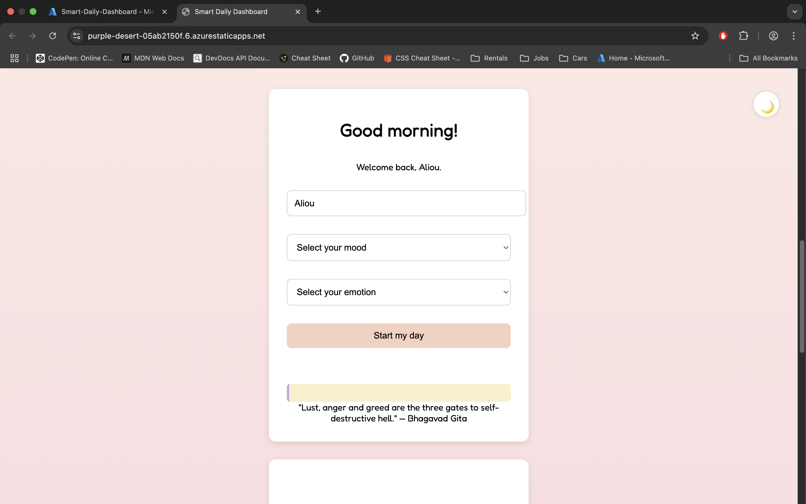

# 🧠 Smart Daily Dashboard

A minimal, fully client-side productivity tool to track your mood, tasks, and journal — all stored privately in your browser with no backend.



## 🌐 Live Demo

**[Launch Smart Daily Dashboard](https://purple-desert-05ab2150f.6.azurestaticapps.net)**

---

## 🔧 Features

- 🌞 Good morning / afternoon / evening greeting
- 🎭 Mood + emotion selector with tailored advice
- 📝 Journal entries saved by date (view/edit anytime)
- ✅ Task tracker with daily productivity bar chart
- 📅 Calendar highlights days with saved logs
- 🌚 Toggle between light/dark theme
- 📖 Inspirational quote fetched on load
- 💾 All data saved securely in localStorage

---

## 📁 Folder Structure
smart-daily-dashboard/
│
├── public/                   # Static frontend files
│   ├── index.html            # Main HTML file
│   ├── style.css             # UI styling
│   └── script.js             # JavaScript logic
│
├── .github/workflows/        # Azure Static Web App deployment
│   └── azure-static-web-apps-*.yml
│
├── main.tf                   # Terraform config to provision Azure SWA
├── README.md                 # You’re reading it!
└── Screenshot-Homepage.png  # Image for README preview
---

## 🚀 Tech Stack

| Layer         | Tech                            |
|--------------|----------------------------------|
| Frontend     | HTML, CSS, JavaScript (Vanilla) |
| Hosting      | Azure Static Web Apps            |
| Infra as Code| Terraform                        |

---

## 📦 Setup Locally

```bash
# 1. Clone the repo
git clone https://github.com/yourusername/smart-daily-dashboard.git

# 2. Open in VS Code
cd smart-daily-dashboard
code .

# 3. Run by opening public/index.html in browser

Note: No Node.js or npm needed — this is a 100% static frontend project.

⸻

🧠 Inspiration

This project was built to develop deeper frontend skills while designing something personally meaningful. It helped me:
	•	Practice DOM manipulation and localStorage
	•	Integrate real-time quote APIs
	•	Learn Azure Static Web App deployment
	•	Manage deployment pipelines with Terraform

⸻

👨🏾‍💻 Author

Aliou Cisse
	•	🔗 LinkedIn - https://www.linkedin.com/in/aliou-c-36b174133/
	•	📫 aliou_cisse221@icloud.com 
	•	🛠️ Built with passion and long nights of code

⸻

✅ Future Enhancements
	•	Add editable tags to journal entries
	•	Export logs to PDF
	•	Add persistent theme toggle across sessions
	•	Cloud sync via Supabase or Firebase

⸻

📜 License

MIT — free for personal and commercial use.
